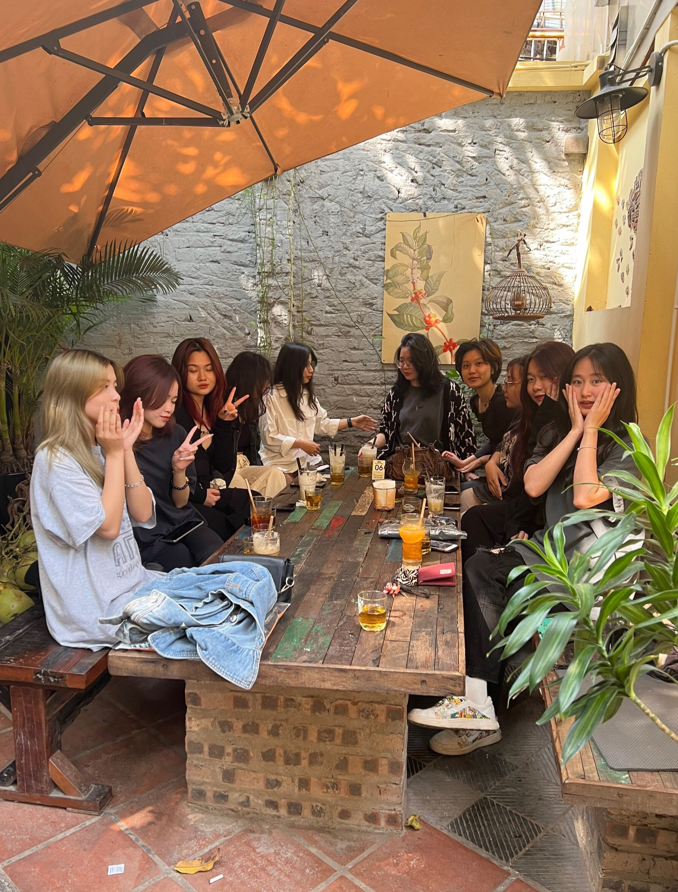

# sample-21080344
<html lang="en"><head>
    <meta charset="UTF-8">
    <meta name="viewport" content="width=device-width, initial-scale=1.0">
    <title>Phí Phương Uyn - 21080344</title>
    <link rel="stylesheet" href="./styles.css">
</head>
<body>

<h1 style="color: #6699CC" ;="">Hello! I am Phi Phuong Uyen from Ferb's Phineas' friend.</h1>
<h2> Welcome to my website</h2>

  
  

<h1 style="color: #6699CC" ;="">Giới thiệu </h1>

<table style="cellpadding=&quot;10px&quot;">
<tbody><tr>
<td></td>
<td>
<strong>Name:</strong> Phi Phuong Uyen 
 <strong>MSSV:</strong> 21080344 
 <strong>Birthday:</strong> 20 . 11 . 2003 
 <strong>School:</strong> Hanoi School of Bussiness and Management 
 <strong>Country:</strong> VietNam 

</td>
</tr></tbody></table>

  
  
  
  
  

<h2 style="color: #6699CC" ;="">My likes and dislikes</h2>
<table style="font-size:x-large; " border="1" cellpadding="30px" bgcolor="#fffde0">
<tbody><tr>
<td><strong>Like</strong></td>
<td>Chocolate</td>
<td>Fast food</td>
<td>Traveling</td>
</tr>
<tr>
<td><strong>Dislike</strong></td>
<td>Bitter melon</td>
<td>Sour candy</td>
<td>Sleeping late</td>
</tr>
</tbody></table>

  
  

My likes and dislikes
<table style="font-size:x-large" cellpadding="30px">
<tbody><tr>
<td></td>
<td></td>
<td></td>
</tr>
</tbody></table>

<table style="font-size:x-large" cellpadding="30px">
<tbody><tr>
<td></td>
<td></td>
</tr>
</tbody></table>

<h1 style="color: #6699CC" ;="">About my school</h1>

  

 Our university has 4 undergraduate programs:

<ul>
<li>MAS</li>
<li>MAC</li>
<li>MET</li>
<li>HAT</li>
</ul>

 Our university has 3 master programs:

<ol>
<li>MOTE</li>
<li>MNS</li>
<li>MBA</li>
</ol>
  

<video width="700" heigth="700" controls="" autoplay="">
<source src="hsb.mp4" type="video/mp4">
The browser doesnt support <video> element.
</video>

</video>

  

<button style="font-size: 1.5rem; align:center; background-color:#6699CC;
border:1px; border-radius:10px;"><a href="http://www.hsb.edu.vn ">HOMEPAGE</a></button>
  
  

<table style="font-size:large; " border="0" cellpadding="10px" bgcolor="#fffde0">
<form></form>
<tbody><tr><td><h2>Your information </h2></td></tr>
<tr><td>Name:</td><td> <input type="text" name="name"></td></tr>
<tr><td>Date of birth</td><td> <input type="date" name="date"></td></tr>
<tr><td>Email</td><td> <input type="email" name="email"></td></tr>
<tr><td>Contact</td><td> <input type="tel" name="tel"></td></tr>
<tr><td>Message</td><td> <input type="text" name="text"></td></tr>
<tr><td>Document Attached</td><td> <input type="file" name="attached"></td></tr>
<tr> <td><input type="submit" name="submit" value="Rest"></td>
<td><input type="submit" name="submit" value="Submit"></td>
</tr>

</tbody></table>

</body>

</html>
